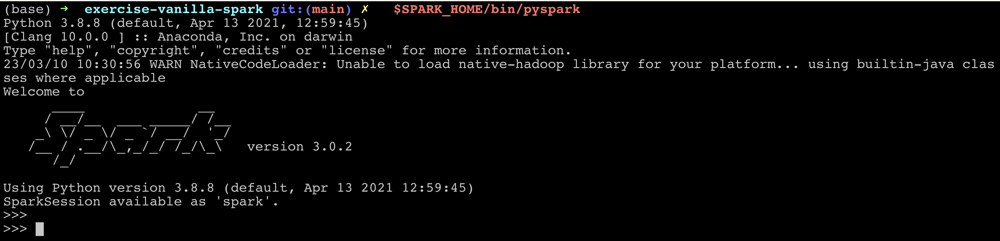

# Java Standard Edition Set up Instructions

The Java version that is used for the examples demonstrated on the Spark Shell is Java 8 (specifically "adoptopenjdk8" openjdk ). This can be installed on your machines using the below commands (Please ensure that all the other java versions are uninstalled before proceeding)
```
brew tap AdoptOpenJDK/openjdk 
brew install --cask adoptopenjdk8
```
Please also note that for the above command to work, homebrew package manager should be installed on your machines. Please refer to this [link](https://brew.sh/) to install it.


# Python Set up Instructions
The Python version used is the latest version that comes with Anaconda (it is most simple and hassle-free, isn't it ?). So go to the anaconda link [here](https://www.anaconda.com/) and install the latest version most suitable for your machine processor. Once done, open a terminal, type "python" and hit Enter. It should start a python shell.

**Note 1:** Please ensure that all the other python versions are uninstalled 

**Note 2:** If python shell is not starting after Anaconda installation, it could be an aliasing issue. You can execute the below steps to fix it and try again.

**Note 3:** Please ensure that you are installing Python only via Anaconda installation as mentioned above. Please don't install Python using the downloaded .dmg files.

```
# Open your zshrc or bash_profile as appropriate and add the following  
alias python=python3

# Save and close the file and run the following command
source ~/.zshrc or source ~/.bash_profile as appropriate

```

# Apache Spark Set up Instructions

The Apache Spark version that I used for the examples demonstrated use version 3.0.2. You can set it up on your local machine using the following steps

1. Please download the file named `spark-3.0.2-bin-hadoop2.7.tgz` (It should be ~ 200MB) from this [link](https://archive.apache.org/dist/spark/spark-3.0.2/) at a preferred location on your machine
2. Extract / Un tar it to get a folder by the name "spark-3.0.2-bin-hadoop2.7".`tar –xvzf spark-3.0.2-bin-hadoop2.7-hive1.2.tgz`
3. Set up the location of the folder extracted in step 2 as your `SPARK_HOME` in your `.bash_profile` or `.zshrc` file `export SPARK_HOME="<YOUR_PREFERRED_LOCATION>/spark-3.0.2-bin-hadoop2.7`
4. Add the `bin` folder of SPARK_HOME to the path. `export PATH="$JAVA_HOME/bin:$SPARK_HOME/bin`)
5. You should be good to go now. Echo SPARK_HOME `echo $SPARK_HOME` from your terminal. You should be able to get the path to your spark installation location.
6. Open a new terminal and type `$SPARK_HOME/bin/spark-shell`. The spark shell should start with Spark version 3.0.2. 
7. The same can be done for pyspark `$SPARK_HOME/bin/pyspark`. Please note that in order for pyspark to work, you need to have python installed on your machines as mentioned above. 

# Repo set up in Pycharm
1. Please install PyCharm community edition from this [link](https://www.jetbrains.com/pycharm/download/#section=mac).
2. Clone this repo on the location of your choice on your machine.
3. Open the Repo in Pycharm.
4. Go to your Pycharm **Settings**, select your project and select the **Python Interpreter** option. 
5. Make sure that you select **No Interpreter** from the `Python Interpreter` **dropdown** and click **Add Interpreter** and select **Add Local Interpreter**. 
6. A dialog box will Pop up. Select the option of **Virtualenv Environment**. 
7. In the options on the right-hand side of the same dialog box, select **Environment** as **New**, **Location** as any suitable location to save python "venv" folder on your local machine, leave the **Base Interpreter** as default and select **Inherit global site packages** checkbox. 
8. This should set up your Python Virtual Env for this repo. Double-check your Python Interpreter from **Setting** again and make sure that your newly created Python interpreter is selected for the project. 
9. Now if your Python Interpreter is created and selected as per the instructions above, you should get a message like `Package requirements 'pyspark...' etc. are not installed`. Click on the **install requirement** link to install the plug-ins required for this repo. These plug-ins are listed down in the `requirements.txt` of this repo. 
10. You are all set now to run your first program of this repo. Open source file `00 - File Reads.py` from the SRC folder of this repo and run it. It should give you the desired output of the dataframe as shown below. 

**PS**: Please note that you don't need a separate Apache Spark installation on your local machine to run the examples of this repo from Pycharm. The PySpark plug-in you have configured above should be sufficient.

